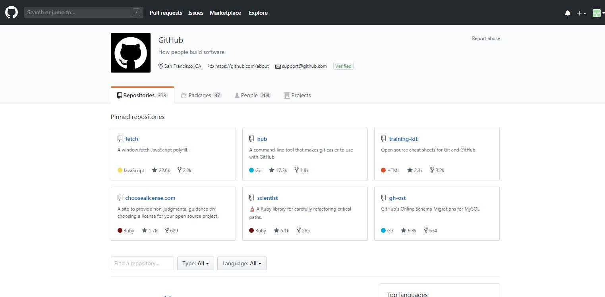

# 学习总结
## VsCode
### VsCode 简介
>VsCode 简介,
VSCode是微软出的一款轻量级代码编辑器，免费而且功能强大，对JavaScript和NodeJS的支持非常好，自带很多功能，例如代码格式化，代码智能提示补全、Emmet插件等。VSCode推荐一个项目以文件夹的方式打开。
### vscode 功能
1. Auto Rename Tag 修改html标签，自动帮你完成尾部闭合标签的同步修改，和webstorm一样。
2. Auto Close Tag 自动闭合HTML标签
3. Beautiful 格式化代码的工具
4. Dash Dash是MacOS的API文档浏览器和代码段管理器
5. Ejs Snippets ejs 代码提示
6. ESLint 检查javascript语法错误与提示
7. File Navigator 快速查找文件
8. Git History(git log)查看git log
9. Gulp Snippets 写gulp时用到，gulp语法提示。
10. HTML CSS Support  在HTML标签上写class智能提示当前项目所支持的样式

> ### 快捷键
 
 
## MarkDown
### markdown简介
> Markdown具有一系列衍生版本，用于扩展Markdown的功能(如表格、脚注、内嵌HTML等等)，这些功能原初的Markdown尚不具备，它们能让Markdown转换成更多的格式，例如LaTeX，Docbook。Markdown增强版中比较有名的有Markdown Extra、MultiMarkdown、 Maruku等。这些衍生版本要么基于工具，如Pandoc;要么基于网站，如GitHub和Wikipedia，在语法上基本兼容，但在一些语法和渲染效果上有改动。
### markdown语法
1. 标题 :
在想要设置为标题的文字前面加#来表示
一个#是一级标题，二个#是二级标题，以此类推。支持六级标题。

代码如下：
```
#           这是一级标题
##          这是二级标题
###         这是三级标题
####        这是四级标题
#####       这是五级标题
######      这是六级标题


```
效果如下:
#           这是一级标题
##          这是二级标题
###         这是三级标题
####        这是四级标题
#####       这是五级标题
######      这是六级标题

2. 字体

**加粗**

要加粗的文字左右分别用两个*号包起来
```
**字体加粗**
```

*斜体*

要倾斜的文字左右分别用一个*号包起来
```
*字体倾斜*
```

***斜体加粗***

要倾斜和加粗的文字左右分别用三个*号包起来
```
***斜体加粗***
```

~~删除线~~

要加删除线的文字左右分别用两个~~号包起来
```
~~删除线~~
```
3. 引用

在引用的文字前加>即可。引用也可以嵌套，如加两个>>三个>>>
n个...
代码如下：
```
>这是引用的内容

>>这是引用的内容

>>>>>>>>>>这是引用的内容
```

效果如下：

>这是引用的内容

>>这是引用的内容

>>>>>>>>>>这是引用的内容


4. 分割线
---

三个或者三个以上的 - 或者 * 都可以。
```
---

----

***

*****
```

5. 图片
语法：
```


图片alt就是显示在图片下面的文字，相当于对图片内容的解释。
图片title是图片的标题，当鼠标移到图片上时显示的内容。title可加可不加
```
代码示列：

```

```


6. 超链接

```html
<a href="超链接地址" target="_blank">超链接名</a>

示例
<a href="https://www.jianshu.com/u/1f5ac0cf6a8b" target="_blank">简书</a>

```

## Git & GitHub
### 关于Git
> Git是一个免费的开源 分布式版本控制系统，旨在快速高效地处理从小型到大型项目的所有事务。

> Git 易于学习， 占地面积小，具有闪电般快速的性能。它超越了Subversion，CVS，Perforce和ClearCase等SCM工具，具有廉价本地分支，便捷的临时区域和 多个工作流程等功能。

[Git官网](https://git-scm.com/)

官网界面如下：

### 关于GitHub
> gitHub是一个面向开源及私有软件项目的托管平台，因为只支持git 作为唯一的版本库格式进行托管，故名gitHub。

> gitHub于2008年4月10日正式上线，除了git代码仓库托管及基本的 Web管理界面以外，还提供了订阅、讨论组、文本渲染、在线文件编辑器、协作图谱(报表)、代码片段分享(Gist)等功能。目前，其注册用户已经超过350万，托管版本数量也是非常之多，其中不乏知名开源项目 Ruby on Rails、jQuery、python 等。

[GitHub官网](https://github.com/)

官网界面如下：



## 码云
### 码云简介
> 码云是一个活动票务管理系统，为您方便的创建一个可以在线报名，使用二维码签到的活动，并且针对中小活动免费使用·只需注册网站，发布活动后，将活动报名地址共享给用户即可。

### 如何使用码云
 1. 创建项目
点击右上角的,
图标

出现下图界面


依次填写各项信息然后点击创建就可以了，这样我们一个项目就创建好了如果没有意外，你将看到这个页面:


这样，我们在码云平台就创建好了一个项目